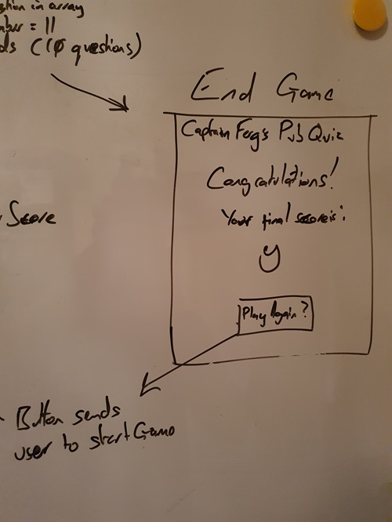

# Captain Ferg's Pub Quiz

- Captain Ferg's (Cpt Ferg) Pub Quiz is based upon the orignal Captain Ferg's Pub Quizzer that I wrote and presented on a weekly basis in various locations around the UK!
- The Pub Quiz is meant to be a light hearted game for one or more people or for a Quiz Master that requires an instant quiz.
- The Pub Quiz is particularly useful for Quiz Masters and for quiz enthusiasts.
- The Pub Quiz provides a simple, 10 question game.
- The Pub Quiz takes questions from it's Question Sheet and randomises the questions without repeating them.

## Table of Contents

Click here for Table of Contents

[Mockup Screenshots](#mockup-screenshots)

[UX](#ux)

- [Colour Scheme](#colour-scheme)
- [Typography](#typography)

[Wireframes](#wireframes)

[User Stories](#user-stories)

- [New site Users](#new-site-users)
- [Returning Site Users](#returning-site-users)

[Features](#features)

- [Existing Features](#existing-features)
- [Future Features](#future-features)

[Testing](#testing)

- [Code Validation](#code-validation)

  - [HTML](#html)
  - [CSS](#css)
  - [Lighthouse](#lighthouse)

- [User Stories](#user-stories)

[Deployment](#deployment)

- [Local Deployment](#local-deployment)

- [Local vs Deployment](#local-vs-deployment)

[Credits](#credits)

- [Content and Code](#content-and-code)

- [Media](#media)

- [Acknowledgments](#acknowledgements)

## Mockup Screenshots

 Using the "Am I Responsive" website, here are three examples of the site showig responsivity.

| Index / Main |
| :---: |
|  |
## UX

- The design for Cpt Ferg's Pub Quiz was created as a series of wireframes sketches covering mobile, tablet and desktop to determine the initial design and layout of the site.
- The Pub Quiz site was designed to provide a swift and simple quiz that was suitable for any age.
- A layout was chosen for it's simplicity and to offer a higher contrast for legability.
- The Pub Quiz expects to see repeated use and, later, even more options for the types of quiz questions.

### Colour Scheme

- The chosen colour scheme for Your Weather is designed to be inviting and have a neutral aesthetic while giving a nice splash of colour.
- The colours used are as follows:-

- `#azure` used for the primary logo and bordering for objects.
- `#black` used for primary text and for the general background.

Click for Colors screenshot

 

### Typography

- I used the Google Fonts called 'Quicksand' and 'Chakra Petch' for The Pub Quiz site.
- I felt that 'Quicksand' was easy-on-the-eyes while not seeming too formal for the primary elements of the quiz.
- 'Chakra Petch' was picked because it provided an aesthetic contrast to 'Quicksand' so that the score and question number stand out amongst other text.   
- [Quicksand](https://font.google.com/specimen/Quicksand) was used for the major text within the site.
- [Chakra Petch](https://fonts.google.com/specimen/Chakra+Petch) was used for minor text within the site.

## Wireframes

The original plan and the sketches of each of the html pages were drawn roughtly on a board and photographed.

| Page | Screenshot |
| :---: | :---: |
| Original Plan |  |
| Index |  |
| Quiz Area |  |
| End Game |  |

## Features

### Existing Features

| Feature | Description | Screenshot |
| :---: | :---: | :---: |
| **Index** | The Main page provides a launchpad for the user upon arriving at the site. |  |
| **Randomised Questions** | The Quiz, upon being started, takes all the available questions and shuffles them using a Fisher-Yates algorith. |  |
| **Buttons** | The Answer Buttons have been sized in order to make the questions legible and easy to use without accidentally tapping another. |  |
| **End Game** | After the game ends, the score is presented and the user may try again. |  |

### Future Features

- Choose a Subject
  - A feature to allow a user to choose what subject they will be quizzed on.
- Special Questions
  - The Original Captain Ferg's Pub Quiz had special rounds with questions that offered more points for each correct answer (ie, name each of the Seven Dwarfs 1 - 7 points)
- A Music round
  - A special round of the Quiz that plays the first 15 seconds of a song.

## Tools & Technologies Used

- [HTML](https://en.wikipedia.org/wiki/HTML) used for the main site content.
- [CSS](https://en.wikipedia.org/wiki/CSS) used for the main site design and layout.
- [CSS Flexbox](https://www.w3schools.com/css/css3_flexbox.asp) used for an enhanced responsive layout.
- [Javascript](https://en.wikipedia.org/wiki/JavaScript) used to provide the system and questions for the game
- [Git](https://git-scm.com) used for version control. (`git add`, `git commit`, `git push`)
- [GitHub](https://github.com) used for secure online code storage.
- [GitHub Pages](https://pages.github.com) used for hosting the deployed front-end site.
- [VSCode](https://code.visualstudio.com/) used for local IDE for development.
- [paint](https://www.microsoft.com/en-us/windows/paint) used for editing images, screenshots and favicon.
- [Favicon.cc](https://www.favicon.cc/) used to create the favicon.
- [Google Fonts](https://fonts.google.com/) used to search a suitable font and obtain a download link for that font.
- [Font Awesome](https://fontawesome.com/) used to add GitHub icon to the footer and modal and search icon to the search button.

## Testing

The biggest problems that I faced, regarding JavaScript, was with displaying the question and checking the answer - adding global variables was the solution.
Aside from that, the CSS was problematic but only because I had over-complicated it - removing several parts not only allowed the scroll to appear on the Launch behind the mind blown picture, but also made it easy to resize without the need for media queries while also containing the features within.

## Code Validation

### HTML

I have used the recommended [HTML W3C Validator](https://validator.w3.org) to validate all of my HTML files.

| Page | Screenshot | Notes |
| :---: | :---: | :---: |
| Index |  | The document is not mappable to XML 1.0 due to two consecutive hyphens in a comment (x6) and Empty heading (x2).|

### CSS

I have used the recommended [CSS Jigsaw Validator](https://jigsaw.w3.org/css-validator/validator) to validate all of my CSS files.

| Report | Screenshot |
| :---: | :---: |
| style.css |  |

### JavaScript

Below is the recommended [JSHint](https://jshint.com/) Results.

| Report | Screenshot |
| :---: | :---: |
| script.js |  |

### Lighthouse

Below is the Lighthouse results.

| Report | Screenshot |
| :---: | :---: |
| Lighthouse |  |

## User Stories

I asked family and friends if they would try using the quiz and provide a little feedback.

### New Site Users

- As a new site user, I would like the buttons to be large and clear.
- As a new site user, I would like questions to be large and clear.
- As a new site user, I would like to know my total score at the end of the quiz.

### Returning Site Users

- As a returning site user, I would like even more questions.
- As a returning site user, I would like to have a quiz on a specialist subject, eg.: sports, history, etc.

## Deployment

The site was deployed to GitHub Pages. The steps to deploy are as follows:

- In the [GitHub repository](https://github.com/fergus-stonehouse/Pub-Quiz), navigate to the Settings tab.
- From the source section drop-down menu, select the **Main** Branch, then click "Save".
- The page will be automatically refreshed with a detailed ribbon display to indicate the successful deployment.

The live link can be found [here](https://fergus-stonehouse.github.io/Pub-Quiz/).

### Local Deployment

This project can be cloned or forked in order to make a local copy on your own system.

### Local vs Deployment

There are no notable differences between my local developed site and the GitHub pages deployed site.  It was also viewed repeatedly on a mobile phone to see any differences.

## Credits

The following are credits to various people and technologies that have directly or otherwise assisted in the creation of the Your Weather site.

### Content and Code

| Source | Location | Notes |
| --- | --- | --- |
| [W3C](https://validator.w3.org/) | All | Validation |
| [W3 Jigsaw](https://jigsaw.w3.org/css-validator/) | All | Validation |
| [JSHint](https://jshint.com/) | All | Validation |
| [Stack Overflow](https://stackoverflow.com/) | Research | additional javascript research |
| [Medium](https://medium.com/) | Research | additional javascript research |
| [She Codes](https://shecodes.io/) | Research | additional javascript research |
| [Geeks for Geeks](https://geeksforgeeks.org/) | Research | additional javascript research |

### Acknowledgements

- I would like to thank my Code Institute mentor, [Chris Quinn](https://github.com/10xOXR) for their patience, knowledge and encouragement.
- I would like to thank [Code Institute](https://codeinstitute.net) for giving me the opportunity to attempt this course.
- I would like to thank the [Code Institute](https://codeinstitute.net) Tutor team, especially TOM (who's patience with me is a thing of legend), for all their guidance.
- I would like to thank the [Code Institute Slack community](https://code-institute-room.slack.com) for the moral support and general information that helps with my studies.
- I would like to thank my family, friends and pets for their support and providing me with feedback for the site.
- I would like to give special thanks to my partner, Bel, who has been an endless source of support.