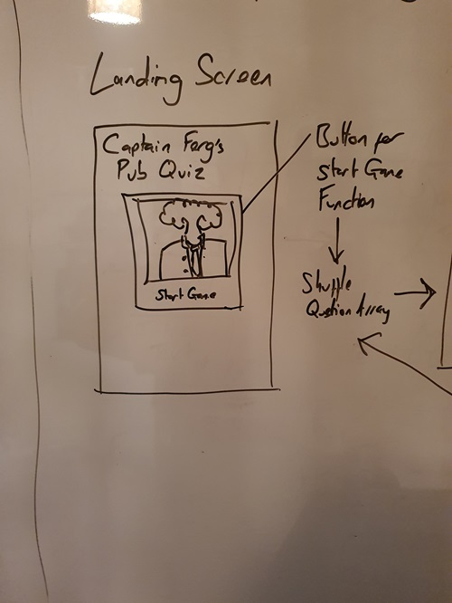

# Captain Ferg's Pub Quiz

- Captain Ferg's (Cpt Ferg) Pub Quiz is based upon the orignal Captain Ferg's Pub Quizzer that I wrote and presented on a weekly basis in various locations around the UK!
- The Pub Quiz is meant to be a light hearted game for one or more people or for a Quiz Master that requires an instant quiz.
- The Pub Quiz is particularly useful for Quiz Masters and for quiz enthusiasts.
- The Pub Quiz provides a simple, 10 question game.
- The Pub Quiz takes questions from it's Question Sheet and randomises the questions without repeating them.

## Table of Contents

Click here for Table of Contents

[Mockup Screenshots](#mockup-screenshots)

[UX](#ux)

- [Colour Scheme](#colour-scheme)
- [Typography](#typography)

[Wireframes](#wireframes)

[User Stories](#user-stories)

- [New site Users](#new-site-users)
- [Returning Site Users](#returning-site-users)

[Features](#features)

- [Existing Features](#existing-features)
- [Future Features](#future-features)

[Testing](#testing)

- [Code Validation](#code-validation)

  - [HTML](#html)
  - [CSS](#css)
  - [Lighthouse](#lighthouse)

- [User Stories](#user-stories)

[Deployment](#deployment)

- [Local Deployment](#local-deployment)

- [Local vs Deployment](#local-vs-deployment)

[Credits](#credits)

- [Content and Code](#content-and-code)

- [Media](#media)

- [Acknowledgments](#acknowledgements)

## Mockup Screenshots

 Using the "Am I Responsive" website, here are three examples of the site showig responsivity.

| Index / Main | Join Us | The Games |
| :---: | :---: | :---: |
|  |  |  |

## UX

- The design for Cpt Ferg's Pub Quiz was created as a series of wireframes sketches covering mobile, tablet and desktop to determine the initial design and layout of the site.
- The Pub Quiz site was designed to provide a swift and simple quiz that was suitable for any age.
- A layout was chosen for it's simplicity and to offer a higher contrast for legability.
- The Pub Quiz expects to see repeated use and, later, even more options for the types of quiz questions.

### Colour Scheme

- The chosen colour scheme for Your Weather is designed to be inviting and have a neutral aesthetic while giving a nice splash of colour.
- The colours used are as follows:-

- `#azure` used for the primary logo and bordering for objects.
- `#black` used for primary text and for the general background.

Click for Colors screenshot

 

### Typography

- I used the Google Fonts called 'Quicksand' and 'Chakra Petch' for The Pub Quiz site.
- I felt that 'Quicksand' was easy-on-the-eyes while not seeming too formal for the primary elements of the quiz.
- 'Chakra Petch' was picked because it provided an aesthetic contrast to 'Quicksand' so that the score and question number stand out amongst other text.   

- [Chakra Petch](https://fonts.google.com/specimen/Chakra+Petch) was used for all text within the site.
- [Quicksand](https://font.google.com/specimen/Quicksand)
- [Font Awesome](https://fontawesome.com) icons were used in The Cellaar site, for GitHub links in the footer and the Game On page.

## Wireframes

The original plan and the sketches of each of the html pages were drawn roughtly on a board and photographed.

| Page | Screenshot |
| :---: | :---: |
| Original Plan |  |
| Index |  |
| Quiz Area |  |
| End Game |  |

## Features

### Existing Features

| Feature | Description | Screenshot |
| :---: | :---: | :---: |
| **Index** | The Main page provides a launchpad for the user upon arriving at the site. |  |
| **Randomised Questions** | The Quiz, upon beig started, takes all the available questions and shuffles them using a Fisher-Yates algorith. |  |
| **Buttons** | The Answer Buttons have been sized in order to make the questions legible and easy to use without accidentally tapping another. |  |
| **End Game** | After the game ends, the score is presented and the user may try again. |  |

### Future Features

- Choose a Subject
  - A feature to allow a user to choose what subject they will be quizzed on.
- Special Questions
  - The Original Captain Ferg's Pub Quiz had special rounds with questions that offered more points for each correct answer (ie, name each of the Seven Dwarfs 1 - 7 points)
- A Music round
  - A special round of the Quiz that plays the first 15 seconds of a song.

## Tools & Technologies Used

- [HTML](https://en.wikipedia.org/wiki/HTML) used for the main site content.
- [CSS](https://en.wikipedia.org/wiki/CSS) used for the main site design and layout.
- [CSS Flexbox](https://www.w3schools.com/css/css3_flexbox.asp) used for an enhanced responsive layout.
- [Javascript](https://en.wikipedia.org/wiki/JavaScript) used to provide the system and questions for the game
- [Git](https://git-scm.com) used for version control. (`git add`, `git commit`, `git push`)
- [GitHub](https://github.com) used for secure online code storage.
- [GitHub Pages](https://pages.github.com) used for hosting the deployed front-end site.
- [VSCode](https://code.visualstudio.com/) used for local IDE for development.
- [paint](https://www.microsoft.com/en-us/windows/paint) used for editing images, screenshots and favicon.
- [Favicon.cc](https://www.favicon.cc/) used to create the favicon.
- [Google Fonts](https://fonts.google.com/) used to search a suitable font and obtain a download link for that font.
- [Font Awesome](https://fontawesome.com/) used to add GitHub icon to the footer and modal and search icon to the search button.

## Testing

## Code Validation

### HTML

I have used the recommended [HTML W3C Validator](https://validator.w3.org) to validate all of my HTML files.

| Page | Screenshot | Notes |
| :---: | :---: | :---: |
| Index |  | Section lacks header h2-h6 warning and The document is not mappable to XML 1.0 due to two consecutive hyphens in a comment warning. x(16) |
| Game On! |  | The document is not mappable to XML 1.0 due to two consecutive hyphens in a comment warning. |
| The Games |  | The document is not mappable to XML 1.0 due to two consecutive hyphens in a comment warning. |
| Join Us |  | The document is not mappable to XML 1.0 due to two consecutive hyphens in a comment warning. |
| Thanks |  | The document is not mappable to XML 1.0 due to two consecutive hyphens in a comment warning. |

### CSS

I have used the recommended [CSS Jigsaw Validator](assets/documentation/images/w3-org-validation-css.jpg) to validate all of my CSS files.

| Report | Screenshot |
| :---: | :---: |
| style.css |  |

### Lighthouse

Below is the Lighthouse Results.  The first time I ran the test, the rating was much lower and suggested that Google Chrome Extensions were impedeing the site's attributes

| Lighthouse |  |

## User Stories

I recruited a variety of people to assist in testing the website, family and friends, and asked some users who would likely use the site again (namely, current members of the actual Cellar Discord channel), to provide feedback. This proved useful as certain images proved making reading the text difficult on the "game-on" page.

### New Site Users

- As a new site user, I would like to know what the site is about, so that I understand what the site does.
- As a new site user, I would like to learn more about what Roleplaying is.
- As a new site user, I would like to learn what games are usully being played on the Channel.
- As a new site user, I would like to discover more about The Cellar Gaming Community.

### Returning Site Users

- As a returning site user, I would like to be able to access the Discord Channel quickly.
- As a returning site user, I would like to be able to visit the official game websites for additional gaming resources.

## Deployment

The site was deployed to GitHub Pages. The steps to deploy are as follows:

- In the [GitHub repository](https://github.com/fergus-stonehouse/Pub-Quiz), navigate to the Settings tab.
- From the source section drop-down menu, select the **Main** Branch, then click "Save".
- The page will be automatically refreshed with a detailed ribbon display to indicate the successful deployment.

The live link can be found [here](https://fergus-stonehouse.github.io/Pub-Quiz/).

### Local Deployment

This project can be cloned or forked in order to make a local copy on your own system.

### Local vs Deployment

There are no notable differences between my local developed site and the GitHub pages deployed site.

## Credits

The following are credits to various people and technologies that have directly or otherwise assisted in the creation of the Your Weather site.

### Content and Code

| Source | Location | Notes |
| --- | --- | --- |
| [W3C](https://validator.w3.org/) | All pages | Validation |
| [W3 Jigsaw](https://jigsaw.w3.org/css-validator/) | All pages | Validation |
| [YouTube](https://www.youtube.com/watch?v=WZNG8UomjSI&t=1783s) | Main page | a source to get an idea of how to lay out the page |
| [Stack Overflow](https://stackoverflow.com/) | Research | additional javascript research |

### Acknowledgements

- I would like to thank my Code Institute mentor, [Chris Quinn](https://github.com/10xOXR) for their patience, knowledge and encouragement.
- I would like to thank  [Simon Boylan](https://github.com/boderg) for the use of their My Weather Readme.md as a template.
- I would like to thank [Code Institute](https://codeinstitute.net) for giving me the opportunity to attempt this course.
- I would like to thank the [Code Institute](https://codeinstitute.net) Tutor team, especially TOM (who's patience with me is a thing of legend), for all their guidance.
- I would like to thank the [Code Institute Slack community](https://code-institute-room.slack.com) for the moral support and general information that helps with my studies.
- I would like to thank my family, friends and pets for their support and providing me with feedback for the site.
- I would like to give special thanks to my partner who has been an endless source of support.